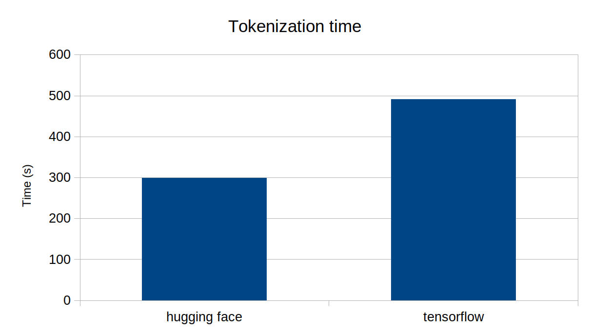

# BERT Tokenizer Benchmark

## Setup
```sh
pip install -r requirement.txt
```

## Run
```sh
time taskset -c 0 python main.py --dataset wikitext --method hf > output.hf
time taskset -c 0 python main.py --dataset wikitext --method tf > output.tf
bash calc_parity.sh output.hf output.tf
```

## Result
Ran on Ubuntu x64. Lower the better.

