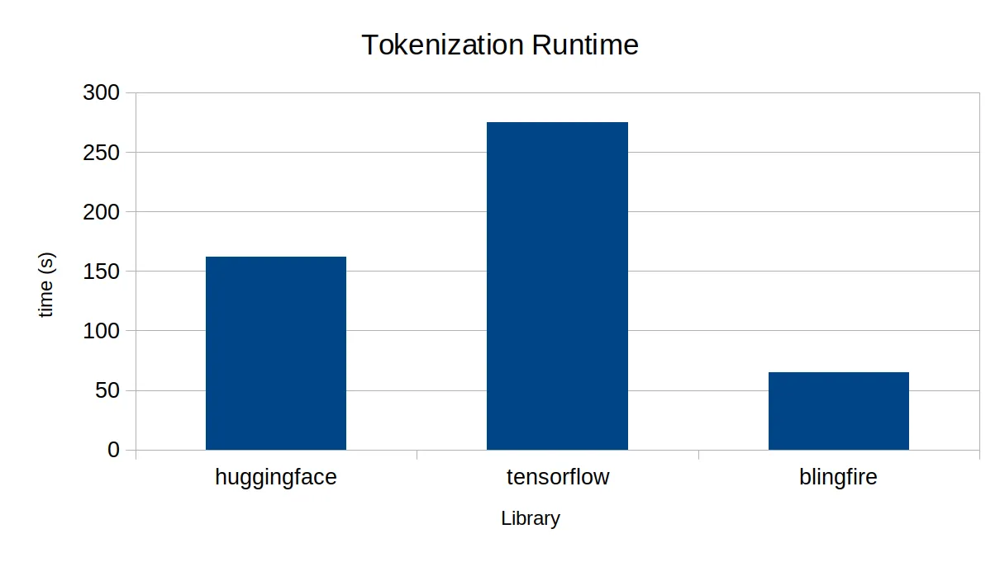

# BERT Tokenizer Benchmark
Compare BERT tokenization speed among HuggingFace, TensorFlow, and BlingFire's implementations.

## Setup
```sh
pip install -r requirement.txt
```

## Run
```sh
for library in hf tf bf; do time taskset -c 0 python main.py --library $library --dataset wikitext > output.$library; done
bash calc_parity.sh output.[ht]f
bash calc_parity.sh output.[hb]f
bash calc_parity.sh output.[tb]f
```

## Result
Ran on Ubuntu x64. Lower the better.

